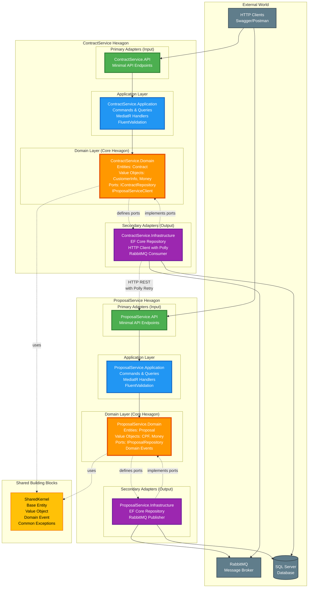

# Hexagonal Architecture Overview - Insurance System

## System Architecture Diagram

## Key Concepts

### Hexagonal Architecture (Ports & Adapters)

**Core Principles:**
- **Domain (Orange)**: Business logic at the center, independent of frameworks
- **Ports**: Interfaces defined by the domain (dashed lines)
- **Adapters**: Implementations of ports (Primary = Input, Secondary = Output)
- **Dependency Rule**: All dependencies point inward toward the domain

### ProposalService Hexagon
- **Primary Adapter**: Minimal API receives HTTP requests
- **Application**: MediatR orchestrates use cases (CQRS pattern)
- **Domain**: Proposal entity with business rules (Approve, Reject)
- **Secondary Adapters**: EF Core (persistence), RabbitMQ (events)

### ContractService Hexagon
- **Primary Adapter**: Minimal API receives HTTP requests
- **Application**: MediatR orchestrates use cases
- **Domain**: Contract entity, validates proposals via HTTP
- **Secondary Adapters**: EF Core, HTTP Client (Polly resilience), RabbitMQ

### Communication Patterns
- **Synchronous**: HTTP REST with Polly retry/circuit breaker
- **Asynchronous**: RabbitMQ for domain events
- **Shared Kernel**: Common base classes reused across services

### Benefits
✅ **Testability**: Mock ports for unit tests (no database needed)
✅ **Flexibility**: Swap SQL Server for MongoDB without changing domain
✅ **Maintainability**: Clear separation of concerns
✅ **Independence**: Domain has zero external dependencies

---

**Created for:** Technical Interview - Insurance System
**Architecture:** Hexagonal (Ports & Adapters)
**Pattern:** CQRS with MediatR
**Technology:** .NET 10, SQL Server, RabbitMQ, Docker
