# Layered Structure Detail - ProposalService

## Detailed Layer Structure with Project Organization

```mermaid
graph TB
    subgraph "ProposalService - Hexagonal Layers"

        subgraph "API Layer - Primary Adapter"
            direction TB
            API[ProposalService.API]
            API_EP["ProposalEndpoints.cs<br/>POST /api/proposals<br/>GET /api/proposals<br/>GET /api/proposals/:id<br/>PATCH /api/proposals/:id/status"]
            API_MW["ExceptionHandlingMiddleware.cs<br/>Problem Details RFC 7807"]
            API_PROG["Program.cs<br/>DI Configuration<br/>Swagger Setup<br/>Health Checks"]

            API --> API_EP
            API --> API_MW
            API --> API_PROG
        end

        subgraph "Application Layer - Use Cases"
            direction TB
            APP[ProposalService.Application]

            subgraph "Commands (Write)"
                CMD_CREATE["CreateProposalCommand<br/>CreateProposalCommandHandler<br/>CreateProposalCommandValidator"]
                CMD_UPDATE["UpdateProposalStatusCommand<br/>UpdateProposalStatusCommandHandler<br/>UpdateProposalStatusCommandValidator"]
            end

            subgraph "Queries (Read)"
                QRY_GET["GetProposalByIdQuery<br/>GetProposalByIdQueryHandler"]
                QRY_LIST["ListProposalsQuery<br/>ListProposalsQueryHandler"]
            end

            subgraph "Cross-Cutting"
                APP_DTO["DTOs<br/>ProposalDto<br/>PagedResult"]
                APP_VAL["ValidationBehavior<br/>FluentValidation Pipeline"]
            end

            APP --> CMD_CREATE
            APP --> CMD_UPDATE
            APP --> QRY_GET
            APP --> QRY_LIST
            APP --> APP_DTO
            APP --> APP_VAL
        end

        subgraph "Domain Layer - Core Hexagon"
            direction TB
            DOM[ProposalService.Domain]

            subgraph "Entities"
                DOM_ENT["Proposal.cs<br/>+ Id - Guid<br/>+ ProposalNumber - string<br/>+ CustomerCPF - CPF<br/>+ InsuranceValue - Money<br/>+ Status - ProposalStatus<br/>---<br/>+ Create - Proposal<br/>+ Approve - void<br/>+ Reject - void"]
            end

            subgraph "Value Objects"
                DOM_VO["CPF.cs<br/>Money.cs<br/>ProposalStatus.cs enum"]
            end

            subgraph "Ports (Interfaces)"
                DOM_PORT["IProposalRepository<br/>+ GetByIdAsync<br/>+ GetAllAsync<br/>+ AddAsync<br/>+ UpdateAsync<br/>---<br/>IProposalEventPublisher<br/>+ PublishAsync"]
            end

            subgraph "Domain Events"
                DOM_EVT["ProposalCreatedEvent<br/>ProposalApprovedEvent<br/>ProposalRejectedEvent"]
            end

            DOM --> DOM_ENT
            DOM --> DOM_VO
            DOM --> DOM_PORT
            DOM --> DOM_EVT
        end

        subgraph "Infrastructure Layer - Secondary Adapters"
            direction TB
            INFRA[ProposalService.Infrastructure]

            subgraph "Persistence (EF Core)"
                INFRA_DB["ProposalDbContext.cs<br/>---<br/>ProposalConfiguration.cs<br/>Entity Type Configuration<br/>Indexes, Relationships<br/>---<br/>ProposalRepository.cs<br/>implements IProposalRepository"]
            end

            subgraph "Messaging (RabbitMQ)"
                INFRA_MSG["ProposalEventPublisher.cs<br/>implements IProposalEventPublisher<br/>---<br/>Uses MassTransit<br/>IPublishEndpoint"]
            end

            subgraph "Configuration"
                INFRA_DI["DependencyInjection.cs<br/>Register Repositories<br/>Register Publishers<br/>Configure EF Core<br/>Configure MassTransit"]
            end

            INFRA --> INFRA_DB
            INFRA --> INFRA_MSG
            INFRA --> INFRA_DI
        end

        subgraph "SharedKernel - Building Block"
            SHARED["SharedKernel<br/>---<br/>Entity.cs abstract<br/>ValueObject.cs abstract<br/>DomainEvent.cs abstract<br/>DomainException.cs<br/>Result.cs"]
        end

    end

    subgraph "External Dependencies"
        SQL[(SQL Server<br/>ProposalDb)]
        RMQ[RabbitMQ<br/>Events Exchange]
    end

    %% Dependencies flow (Hexagonal principle: inward)
    API_EP --> APP
    APP --> DOM
    DOM -.defines.-> DOM_PORT
    INFRA -.implements.-> DOM_PORT

    INFRA_DB --> SQL
    INFRA_MSG --> RMQ

    DOM --> SHARED

    %% Styling
    classDef api fill:#4CAF50,stroke:#2E7D32,stroke-width:3px,color:#fff
    classDef app fill:#2196F3,stroke:#1565C0,stroke-width:3px,color:#fff
    classDef domain fill:#FF9800,stroke:#E65100,stroke-width:4px,color:#fff
    classDef infra fill:#9C27B0,stroke:#6A1B9A,stroke-width:3px,color:#fff
    classDef shared fill:#FFC107,stroke:#F57F17,stroke-width:2px,color:#000
    classDef external fill:#607D8B,stroke:#37474F,stroke-width:2px,color:#fff

    class API,API_EP,API_MW,API_PROG api
    class APP,CMD_CREATE,CMD_UPDATE,QRY_GET,QRY_LIST,APP_DTO,APP_VAL app
    class DOM,DOM_ENT,DOM_VO,DOM_PORT,DOM_EVT domain
    class INFRA,INFRA_DB,INFRA_MSG,INFRA_DI infra
    class SHARED shared
    class SQL,RMQ external
```



## Layer Responsibilities

### 1. API Layer (Primary Adapter) - Green
**Project:** `ProposalService.API`

**Responsibilities:**
- Expose HTTP endpoints (Minimal APIs)
- Handle HTTP concerns (routing, status codes)
- Exception handling middleware
- Swagger/OpenAPI documentation
- Dependency injection configuration

**Key Files:**
- `ProposalEndpoints.cs` - Minimal API route definitions
- `ExceptionHandlingMiddleware.cs` - Global exception handling
- `Program.cs` - Application startup and configuration

**Dependencies:** → Application Layer (via MediatR)

---

### 2. Application Layer (Use Cases) - Blue
**Project:** `ProposalService.Application`

**Responsibilities:**
- Orchestrate domain operations
- CQRS pattern (Commands for write, Queries for read)
- Input validation (FluentValidation)
- Data transformation (Entity ↔ DTO)
- MediatR handlers

**Key Patterns:**
- **Command**: Modifies state (CreateProposal, UpdateProposalStatus)
- **Query**: Reads data (GetProposalById, ListProposals)
- **Validator**: Input validation with FluentValidation
- **DTO**: Data Transfer Objects for API responses

**Dependencies:** → Domain Layer (Entities, Ports, Value Objects)

---

### 3. Domain Layer (Core Hexagon) - Orange
**Project:** `ProposalService.Domain`

**Responsibilities:**
- Business logic (pure domain logic)
- Entities (Aggregate Roots)
- Value Objects (immutable, compared by value)
- Domain Events (for event-driven architecture)
- Ports (interfaces) - NO implementations

**Key Concepts:**
- **Proposal Entity**: Aggregate root with business methods
  - `Approve()` - Business rule: only InAnalysis proposals can be approved
  - `Reject(reason)` - Business rule: only InAnalysis proposals can be rejected
- **CPF Value Object**: Brazilian CPF validation with check digits
- **Money Value Object**: Currency handling with validation
- **IProposalRepository Port**: Persistence abstraction
- **IProposalEventPublisher Port**: Event publishing abstraction

**Dependencies:** → SharedKernel ONLY (no external frameworks)

**Hexagonal Principle:**
> Domain defines **WHAT** it needs (Ports), not **HOW** it's implemented (Adapters)

---

### 4. Infrastructure Layer (Secondary Adapters) - Purple
**Project:** `ProposalService.Infrastructure`

**Responsibilities:**
- Implement domain ports (adapters)
- Database access (EF Core)
- Message publishing (RabbitMQ via MassTransit)
- External service clients
- Configuration and DI registration

**Key Implementations:**
- **ProposalRepository**: Implements `IProposalRepository` port
  - Uses EF Core for SQL Server access
  - Performance: `AsNoTracking()` for queries
  - Indexes on ProposalNumber, CustomerCPF, Status

- **ProposalEventPublisher**: Implements `IProposalEventPublisher` port
  - Uses MassTransit for RabbitMQ
  - Publishes domain events to message broker

- **ProposalConfiguration**: EF Core entity configuration
  - Maps Proposal entity to database table
  - Configures Value Objects (OwnsOne)
  - Defines indexes and constraints

**Dependencies:** → Domain Layer (implements Ports)

---

### 5. SharedKernel - Yellow
**Project:** `SharedKernel`

**Responsibilities:**
- Base classes shared across all services
- Common abstractions
- Domain primitives

**Key Classes:**
- **Entity**: Base class for all entities (Id, CreatedAt, UpdatedAt)
- **ValueObject**: Base class for value objects (equality by value)
- **DomainEvent**: Base class for domain events
- **DomainException**: Custom exception for domain rule violations
- **Result**: Result pattern for operation outcomes

**Usage:** Referenced by all Domain projects

---

## Dependency Flow (Hexagonal Architecture)

```
External World
      ↓
Primary Adapter (API) ← User input
      ↓
Application Layer ← Orchestrates use cases
      ↓
Domain Layer ← Business logic (CORE)
      ↓ (defines ports)
Secondary Adapters (Infrastructure) ← Implements ports
      ↓
External World (Database, Message Broker)
```

**Key Rule:** Dependencies point **INWARD** toward Domain
- API depends on Application
- Application depends on Domain
- Infrastructure depends on Domain (implements ports)
- Domain depends on NOTHING (except SharedKernel)

---

## CQRS Pattern in Application Layer

### Commands (Write Operations)
```
HTTP POST → CreateProposalCommand
          → CreateProposalCommandValidator (FluentValidation)
          → CreateProposalCommandHandler
              → Proposal.Create() (Domain)
              → IProposalRepository.AddAsync() (Port)
              → IProposalEventPublisher.PublishAsync() (Port)
          → Return ProposalDto
```

### Queries (Read Operations)
```
HTTP GET → GetProposalByIdQuery
         → GetProposalByIdQueryHandler
             → IProposalRepository.GetByIdAsync() (Port)
                  → AsNoTracking() for performance
         → Return ProposalDto
```

**Benefits:**
- ✅ Separate optimization for read vs write
- ✅ Clear intent (Command = change, Query = read)
- ✅ Easier to test and maintain
- ✅ Enables future scaling (separate read/write databases)

---

## Entity Configuration (EF Core)

### Value Object Mapping (OwnsOne)
```csharp
// ProposalConfiguration.cs
builder.OwnsOne(p => p.CustomerCPF, cpf =>
{
    cpf.Property(c => c.Number)
        .HasColumnName("CustomerCPF")
        .HasMaxLength(11);

    cpf.HasIndex(c => c.Number)
        .HasDatabaseName("IX_Proposals_CustomerCPF");
});
```

**Result:** CPF value object stored in same table (no separate table)
- Performance: Single table, no joins
- Encapsulation: CPF validation logic remains in domain

---

**Focus:** Layered structure with Hexagonal Architecture principles
