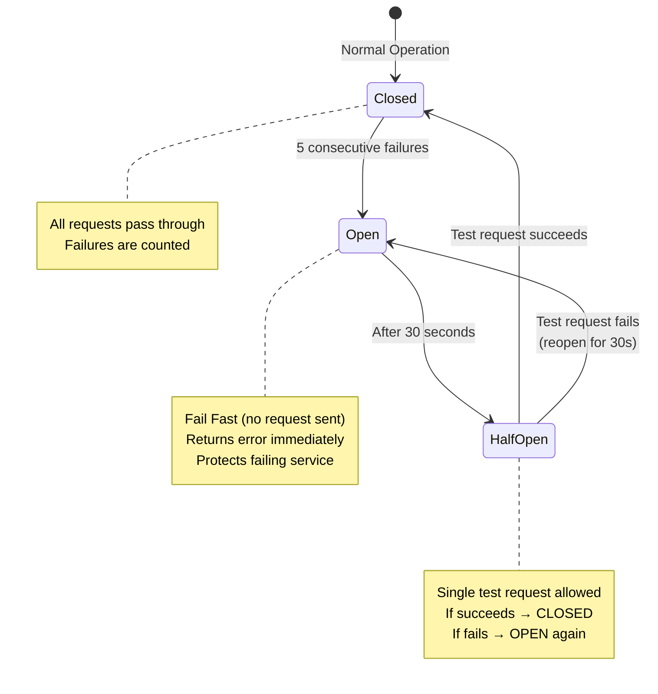

# Microservices Communication Patterns

## Communication Architecture Diagram

```mermaid
sequenceDiagram
    participant Client as HTTP Client<br/>(Swagger/Postman)
    participant PropAPI as ProposalService.API<br/>(Port 5001)
    participant PropApp as ProposalService<br/>Application Layer
    participant PropDomain as ProposalService<br/>Domain Layer
    participant PropRepo as ProposalRepository<br/>(EF Core)
    participant PropDB as SQL Server<br/>ProposalDb
    participant RabbitMQ as RabbitMQ<br/>Message Broker
    participant ContAPI as ContractService.API<br/>(Port 5002)
    participant ContApp as ContractService<br/>Application Layer
    participant ContClient as ProposalServiceClient<br/>(HTTP Client + Polly)
    participant ContRepo as ContractRepository<br/>(EF Core)
    participant ContDB as SQL Server<br/>ContractDb

    %% Create Proposal Flow
    rect rgb(200, 230, 255)
        Note over Client,PropDB: 1. Create Proposal (Synchronous)
        Client->>+PropAPI: POST /api/proposals<br/>{cpf, name, value}
        PropAPI->>+PropApp: CreateProposalCommand
        PropApp->>PropApp: FluentValidation
        PropApp->>+PropDomain: Proposal.Create()
        PropDomain->>PropDomain: Validate CPF<br/>Validate Money
        PropDomain-->>-PropApp: Proposal entity
        PropApp->>+PropRepo: AddAsync(proposal)
        PropRepo->>+PropDB: INSERT INTO Proposals
        PropDB-->>-PropRepo: Success
        PropRepo-->>-PropApp: Success
        PropApp->>RabbitMQ: Publish ProposalCreatedEvent
        PropApp-->>PropAPI: ProposalDto
        PropAPI-->>-Client: 201 Created
    end

    %% Approve Proposal Flow
    rect rgb(255, 240, 200)
        Note over Client,RabbitMQ: 2. Approve Proposal (Async Event)
        Client->>+PropAPI: PATCH /api/proposals/:id/status<br/>{newStatus: "Approved"}
        PropAPI->>+PropApp: UpdateProposalStatusCommand
        PropApp->>+PropRepo: GetByIdAsync(id)
        PropRepo->>+PropDB: SELECT * FROM Proposals
        PropDB-->>-PropRepo: Proposal
        PropRepo-->>-PropApp: Proposal
        PropApp->>+PropDomain: proposal.Approve()
        PropDomain->>PropDomain: Validate: Status == InAnalysis
        PropDomain->>PropDomain: Status = Approved
        PropDomain-->>-PropApp: Success
        PropApp->>+PropRepo: UpdateAsync(proposal)
        PropRepo->>+PropDB: UPDATE Proposals
        PropDB-->>-PropRepo: Success
        PropRepo-->>-PropApp: Success
        PropApp->>RabbitMQ: Publish ProposalApprovedEvent<br/>{proposalId, approvedAt}
        PropApp-->>PropAPI: ProposalDto
        PropAPI-->>-Client: 200 OK
    end

    %% Contract Proposal Flow with Resilience
    rect rgb(200, 255, 200)
        Note over Client,ContDB: 3. Contract Approved Proposal (Sync + Resilience)
        Client->>+ContAPI: POST /api/contracts<br/>{proposalId, durationMonths}
        ContAPI->>+ContApp: ContractProposalCommand
        ContApp->>ContApp: FluentValidation

        %% HTTP Client with Polly Retry
        Note over ContApp,PropAPI: HTTP REST with Polly Resilience
        ContApp->>+ContClient: GetProposalByIdAsync(proposalId)

        rect rgb(255, 200, 200)
            Note over ContClient,PropAPI: Polly Retry Policy (3 attempts)
            ContClient->>PropAPI: GET /api/proposals/:id
            alt Network Error or 5xx
                PropAPI-->>ContClient: ❌ 500 Internal Server Error
                Note over ContClient: Wait 2 seconds (exponential backoff)
                ContClient->>PropAPI: GET /api/proposals/:id (Retry 1)
                alt Still Failing
                    PropAPI-->>ContClient: ❌ 500 Internal Server Error
                    Note over ContClient: Wait 4 seconds
                    ContClient->>PropAPI: GET /api/proposals/:id (Retry 2)
                end
            end
        end

        PropAPI-->>-ContClient: 200 OK + ProposalDto
        ContClient-->>-ContApp: ProposalDto

        ContApp->>ContApp: Validate Status == "Approved"
        ContApp->>+ContRepo: GetByProposalIdAsync()
        ContRepo->>+ContDB: SELECT * WHERE ProposalId
        ContDB-->>-ContRepo: null (not contracted yet)
        ContRepo-->>-ContApp: null

        ContApp->>ContApp: Contract.Create()<br/>Calculate Premium (2% of value)
        ContApp->>+ContRepo: AddAsync(contract)
        ContRepo->>+ContDB: INSERT INTO Contracts
        ContDB-->>-ContRepo: Success
        ContRepo-->>-ContApp: Success

        ContApp->>RabbitMQ: Publish ContractCreatedEvent
        ContApp-->>ContAPI: ContractDto
        ContAPI-->>-Client: 201 Created
    end

    %% Circuit Breaker Flow
    rect rgb(255, 220, 220)
        Note over ContClient,PropAPI: 4. Circuit Breaker (After 5 Failures)
        ContClient->>ContClient: Track failures
        Note over ContClient: After 5 consecutive failures:<br/>Circuit OPENS for 30 seconds
        ContClient-->>ContApp: ❌ CircuitBrokenException<br/>(Fail Fast - No request sent)
        ContApp-->>ContAPI: 503 Service Unavailable
        ContAPI-->>Client: {"error": "ProposalService unavailable"}

        Note over ContClient: After 30 seconds:<br/>Circuit HALF-OPEN (test request)
        ContClient->>PropAPI: GET /api/proposals/:id (Test)
        alt Request Succeeds
            PropAPI-->>ContClient: 200 OK
            Note over ContClient: Circuit CLOSES (normal operation)
        else Request Fails
            PropAPI-->>ContClient: ❌ Error
            Note over ContClient: Circuit remains OPEN for 30s more
        end
    end
```

## Communication Patterns Explained

### 1. Synchronous Communication (HTTP REST)

#### Use Case: Validate Proposal Status
**When:** ContractService needs immediate response about proposal status

**Implementation:**
```csharp
// ContractService.Infrastructure/ExternalServices/ProposalServiceClient.cs
public class ProposalServiceClient : IProposalServiceClient
{
    private readonly HttpClient _httpClient;

    public async Task<ProposalDto?> GetProposalByIdAsync(Guid proposalId)
    {
        var response = await _httpClient.GetAsync($"/api/proposals/{proposalId}");

        if (response.StatusCode == HttpStatusCode.NotFound)
            return null;

        response.EnsureSuccessStatusCode();
        return await response.Content.ReadFromJsonAsync<ProposalDto>();
    }
}
```

**Polly Configuration:**
```csharp
// DependencyInjection.cs
services.AddHttpClient<IProposalServiceClient, ProposalServiceClient>(client =>
{
    client.BaseAddress = new Uri("http://proposal-api:8080");
    client.Timeout = TimeSpan.FromSeconds(30);
})
.AddPolicyHandler(GetRetryPolicy())
.AddPolicyHandler(GetCircuitBreakerPolicy());
```

---

### 2. Asynchronous Communication (RabbitMQ Events)

#### Use Case: Notify Other Services of Domain Events
**When:** Proposal is approved, other services may need to react (but don't need immediate response)

**Domain Event:**
```csharp
// ProposalService.Domain/Events/ProposalApprovedEvent.cs
public sealed record ProposalApprovedEvent : DomainEvent
{
    public Guid ProposalId { get; init; }
    public string ProposalNumber { get; init; }
    public string CustomerName { get; init; }
    public DateTime ApprovedAt { get; init; }
}
```

**Publisher (ProposalService):**
```csharp
// ProposalService.Infrastructure/Messaging/ProposalEventPublisher.cs
public class ProposalEventPublisher : IProposalEventPublisher
{
    private readonly IPublishEndpoint _publishEndpoint; // MassTransit

    public async Task PublishAsync<TEvent>(TEvent domainEvent)
        where TEvent : DomainEvent
    {
        await _publishEndpoint.Publish(domainEvent);
    }
}
```

**Consumer (ContractService - Optional):**
```csharp
// ContractService.Infrastructure/Messaging/ProposalApprovedConsumer.cs
public class ProposalApprovedConsumer : IConsumer<ProposalApprovedEvent>
{
    public async Task Consume(ConsumeContext<ProposalApprovedEvent> context)
    {
        // React to proposal approved (e.g., invalidate cache, send notification)
        _logger.LogInformation("Proposal {ProposalId} was approved",
            context.Message.ProposalId);
    }
}
```

---

## Resilience Patterns with Polly

### 1. Retry Policy (Transient Fault Handling)

#### Configuration
```csharp
static IAsyncPolicy<HttpResponseMessage> GetRetryPolicy()
{
    return HttpPolicyExtensions
        .HandleTransientHttpError()  // 5xx, 408 Request Timeout, network errors
        .WaitAndRetryAsync(
            retryCount: 3,
            sleepDurationProvider: retryAttempt =>
                TimeSpan.FromSeconds(Math.Pow(2, retryAttempt)), // 2s, 4s, 8s
            onRetry: (outcome, timespan, retryAttempt, context) =>
            {
                _logger.LogWarning(
                    "Retry {RetryAttempt} after {Delay}s due to: {Exception}",
                    retryAttempt, timespan.TotalSeconds, outcome.Exception?.Message);
            });
}
```

#### When It Triggers
- HTTP 5xx errors (500, 502, 503, 504)
- HTTP 408 Request Timeout
- Network failures (DNS, connection refused)

#### Backoff Strategy
| Attempt | Wait Time |
|---------|-----------|
| 1       | 2 seconds |
| 2       | 4 seconds |
| 3       | 8 seconds |

**Total max wait:** 14 seconds (2 + 4 + 8)

**Benefits:**
✅ Handles temporary network glitches
✅ Gives service time to recover
✅ Exponential backoff prevents thundering herd

---

### 2. Circuit Breaker Pattern

#### Configuration
```csharp
static IAsyncPolicy<HttpResponseMessage> GetCircuitBreakerPolicy()
{
    return HttpPolicyExtensions
        .HandleTransientHttpError()
        .CircuitBreakerAsync(
            handledEventsAllowedBeforeBreaking: 5,  // Open after 5 failures
            durationOfBreak: TimeSpan.FromSeconds(30),  // Stay open for 30s
            onBreak: (outcome, duration) =>
            {
                _logger.LogError(
                    "Circuit breaker opened for {Duration}s due to: {Exception}",
                    duration.TotalSeconds, outcome.Exception?.Message);
            },
            onReset: () =>
            {
                _logger.LogInformation("Circuit breaker closed, normal operation resumed");
            },
            onHalfOpen: () =>
            {
                _logger.LogInformation("Circuit breaker half-open, testing...");
            });
}
```

#### Circuit States



#### Benefits
✅ **Fail Fast**: Don't waste time on failing service
✅ **Protect downstream**: Give failing service time to recover
✅ **User Experience**: Return error quickly (no timeout wait)
✅ **Resource Conservation**: Don't exhaust connection pool

---

## Data Flow Summary

### Successful Contract Creation Flow
```
1. Client → ContractService API
2. FluentValidation checks input
3. HTTP GET → ProposalService (with Polly retry)
4. Validate proposal status == "Approved"
5. Check no duplicate contract exists
6. Create Contract entity (domain logic)
7. Save to ContractDb (SQL Server)
8. Publish ContractCreatedEvent (RabbitMQ)
9. Return ContractDto to client
```

### Error Scenarios

#### Scenario 1: Proposal Not Approved
```
→ HTTP GET proposal succeeds
→ Status validation fails: Status != "Approved"
→ Throw DomainException("Only approved proposals can be contracted")
→ Exception middleware returns 400 Bad Request
```

#### Scenario 2: ProposalService Temporarily Down
```
→ HTTP GET fails (5xx)
→ Polly Retry: Attempt 1 after 2s
→ HTTP GET fails (5xx)
→ Polly Retry: Attempt 2 after 4s
→ HTTP GET succeeds ✅
→ Continue normal flow
```

#### Scenario 3: ProposalService Completely Down
```
→ HTTP GET fails (connection refused)
→ Polly Retry: All 3 attempts fail
→ After 5 total failures: Circuit OPENS
→ Future requests fail fast (no retry)
→ Return 503 Service Unavailable
→ After 30s: Test request (half-open)
```

---

## Event-Driven Architecture Benefits

### Domain Events Published

#### ProposalService Events
- `ProposalCreatedEvent` - When new proposal is created
- `ProposalApprovedEvent` - When proposal is approved
- `ProposalRejectedEvent` - When proposal is rejected

#### ContractService Events
- `ContractCreatedEvent` - When contract is generated

### Use Cases for Events (Not Implemented, but Possible)

1. **Notification Service** (future)
   - Consumes `ProposalApprovedEvent`
   - Sends email/SMS to customer

2. **Analytics Service** (future)
   - Consumes all events
   - Generates reports and metrics

3. **Audit Service** (future)
   - Consumes all events
   - Stores audit trail

4. **Cache Invalidation**
   - Consumes `ProposalApprovedEvent`
   - Invalidates cached proposal in ContractService

### Benefits of Events
✅ **Loose Coupling**: Services don't know about each other
✅ **Scalability**: Add consumers without changing publisher
✅ **Async Processing**: Don't block main flow
✅ **Eventual Consistency**: Trade-off for scalability

---

## Communication Decision Matrix

| Scenario | Pattern | Reason |
|----------|---------|--------|
| Validate proposal status before contracting | **HTTP REST** | Need immediate response (synchronous) |
| Notify about proposal approval | **RabbitMQ Event** | Don't need immediate response (fire and forget) |
| Get proposal details for contract creation | **HTTP REST** | Need data to proceed (synchronous) |
| Audit trail logging | **RabbitMQ Event** | Non-blocking, can be processed later |
| Send customer notification | **RabbitMQ Event** | Non-critical, can be async |

---

## Performance Considerations

### HTTP Client Optimization
- **Connection pooling**: Reused by HttpClientFactory
- **Timeout**: 30 seconds max (prevents hanging)
- **Compression**: Automatic gzip/deflate handling

### RabbitMQ Optimization
- **Competing Consumers**: Multiple ContractService instances share queue
- **Acknowledgments**: Manual ack after processing (prevents message loss)
- **Prefetch Count**: Limit messages per consumer (prevents overload)

### Database Optimization
- **Separate databases**: Each service has own DB (no shared DB anti-pattern)
- **Indexes**: Strategic indexes on frequently queried columns
- **Connection pooling**: Configured in connection string

---

**Created for:** Technical Interview - Insurance System
**Focus:** Communication patterns, resilience, and event-driven architecture
